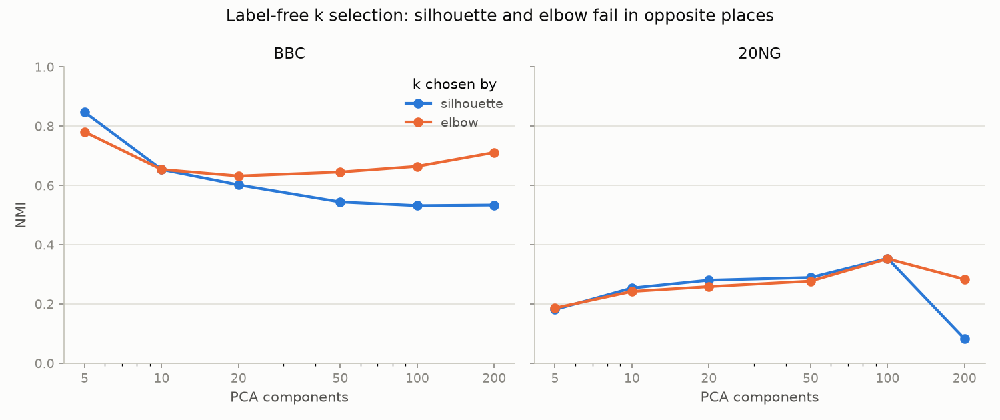
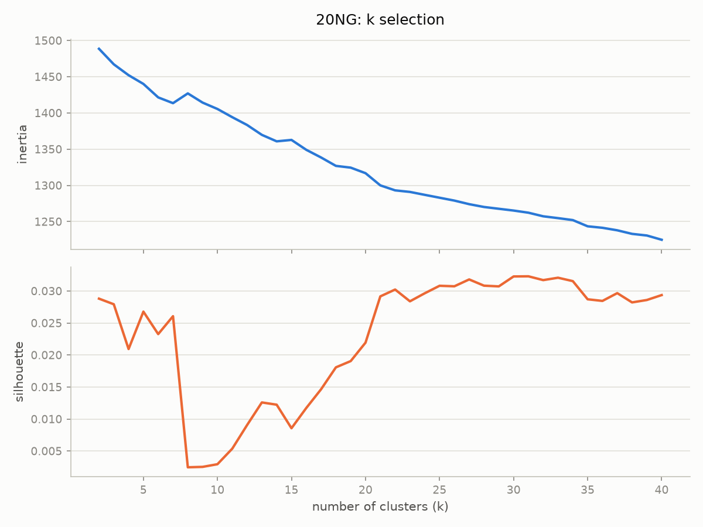
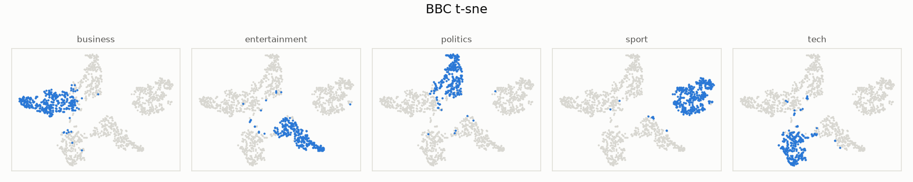
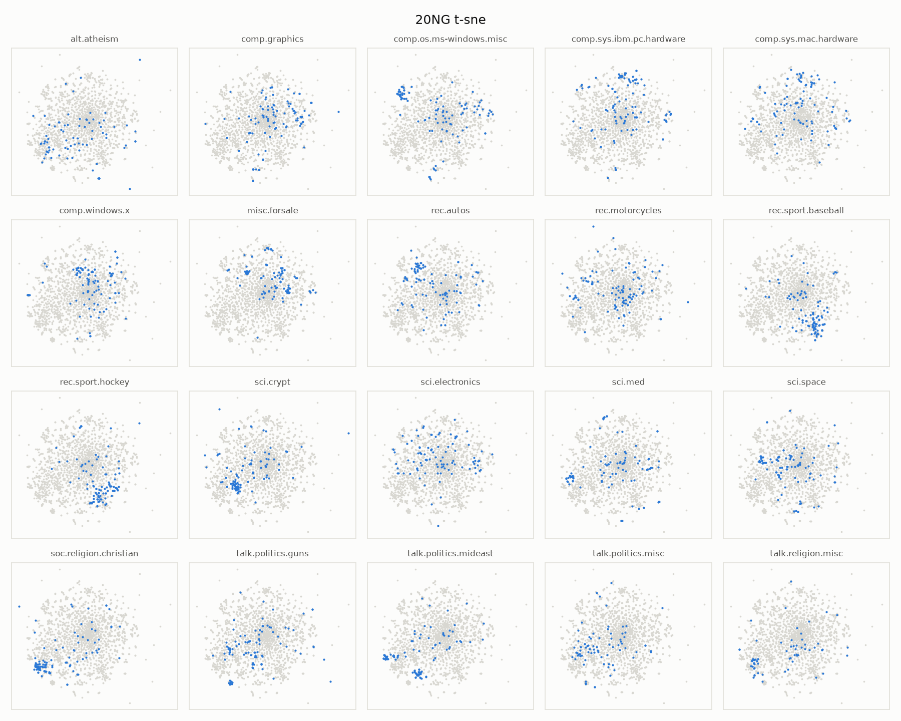

# Text Clustering with PCA and Word Embeddings

Clustering of two text datasets without using their labels. The number of clusters
is discovered from the data, and the true categories are used only at the end to
measure how good the result was.

## Datasets

**BBC News** — 1,490 news articles in 5 categories: business, entertainment,
politics, sport, tech. The categories are close to balanced, between 261 and 346
articles each. The articles are long, with a median of 337 words.

**20 Newsgroups** — 1,885 forum posts in 20 topics. I use the 10% stratified split
so the size stays comparable to BBC News. The topics are not balanced, from 100
posts down to 63. The posts are much shorter than BBC articles, with a median of
82 words, and 12% of them are under 20 words. Headers, footers and quoted replies
are removed, so only the body text is left.

## Pipeline

1. Load the documents.
2. Build TF-IDF vectors.
3. Reduce the dimensions with PCA.
4. Find the number of clusters k from the data, using silhouette and elbow.
5. Cluster with K-Means and Agglomerative Clustering.
6. Score the clusters against the true labels with NMI, ARI and AMI.

The rule I followed throughout: k is never taken from the number of true
categories. It is always found from the vectors themselves. The labels are read
for the first time in step 6, only to score the result. In the code this boundary
is visible: `evaluation.py` is the only module that touches the label column.

## Why TF-IDF

I implemented three embedding methods and compared them before choosing.

TF-IDF works well here because both datasets are topic-based. Topics are separated
mainly by which words appear, and that is exactly what TF-IDF measures. It also
needs no training, so results are stable and reproducible.

Word2Vec and FastText learn word meanings from the corpus itself, which sounds
better in theory. In practice our corpora are too small for that. BBC has about
574K tokens and 20 Newsgroups only 344K. Word vectors normally need much more text
than this. When I tested Word2Vec, averaging the word vectors of each document
pulled all documents towards the corpus average instead of separating them. On BBC
this still produced usable clusters, but on 20 Newsgroups it collapsed into one
large cluster plus a few single documents, the same failure as raw TF-IDF.

So the final pipeline uses TF-IDF. `build_word2vec` and `build_fasttext` are kept
in `features.py` because they are part of the comparison that led to this decision.

## Main decisions

**Cosine distance instead of Euclidean.** Documents have different lengths, which
changes the size of their vectors without changing their topic. Euclidean distance
would treat a short and a long article on the same subject as far apart. I compare
documents by direction instead. K-Means has no cosine option in scikit-learn, so I
normalise every vector to unit length first, which makes Euclidean distance behave
like cosine. Agglomerative Clustering accepts a distance matrix, so it gets real
cosine distances.

**TruncatedSVD for TF-IDF, PCA for dense vectors.** Scikit-learn's PCA cannot take
sparse input, because centering the data destroys sparsity. TruncatedSVD is the
same decomposition without the centering step and works directly on sparse
matrices. `reduce_dimensions` picks the right one automatically.

**Precomputed distance matrices.** AgglomerativeClustering rejects sparse input,
and converting a 1,885 by 27,379 TF-IDF matrix to dense would cost around 400MB
for no benefit. Instead I compute the distance matrix once and reuse it for every
k. Its size depends on the number of documents, not on the vocabulary.

**TF-IDF settings.** I did not keep the scikit-learn defaults. This turned out to
be the most important decision in the whole project, so it has its own section
below.

**No text preprocessing.** No lowercasing, no stopword removal, no stemming. The
tokenisation for Word2Vec and FastText is a plain whitespace split.

**Fixed random seeds** everywhere, and single-threaded gensim training, so every
run gives the same numbers.

## What did not work

**Raw TF-IDF is unusable.** With the full vocabulary of 24,746 words for BBC and
27,379 for 20 Newsgroups, all three algorithms failed:

| Algorithm | Result on raw TF-IDF |
|---|---|
| K-Means | Silhouette between -0.03 and 0.01 across the whole k = 2 to 30 range. No peak at all. |
| Agglomerative | One cluster with 1,824 documents, one with 54, and seven clusters with a single document each. The silhouette was identical for every k. |
| HDBSCAN | 2 clusters on BBC with 38% of documents marked as noise. On 20 Newsgroups it found 0 clusters and marked everything as noise. |

The reason is the number of dimensions. In a space with tens of thousands of
dimensions all documents end up roughly equally far from each other, so distance
based algorithms have almost nothing to work with. This is why the PCA step is not
optional here.

**HDBSCAN.** It never recovered on either dataset, so it is not part of the final
results. The code stays in `clustering.py` together with a sweep over its
`min_cluster_size` parameter, since that sweep is what showed it was not usable.

**Agglomerative Clustering on 20 Newsgroups.** It fails at every PCA size I tried,
from 5 to 200 dimensions. It always returns the same split of 1,824 against 61
documents and an NMI of 0.003, which is the same as random. On BBC the same
algorithm works well, so the problem is the dataset, not the implementation.

## The TF-IDF settings mattered more than anything else

The default settings keep every word, even words that appear once in the whole
corpus, and they weight a word that appears 20 times as 20 times more important
than a word that appears once. Both are bad for clustering.

I changed three things:

- `min_df=5` removes words appearing in fewer than 5 documents. On 20 Newsgroups
  this cut the vocabulary from 27,379 to 5,062 words. So 81% of the vocabulary was
  names, typos and one-off strings that only added noise.
- `max_df=0.5` removes words appearing in more than half the documents, which
  cannot separate anything.
- `sublinear_tf=True` uses a logarithmic scale for term frequency.

The effect was large:

| Dataset | Before | After |
|---|---|---|
| BBC News | 0.716 | **0.847** |
| 20 Newsgroups | 0.049 | **0.354** |

The 20 Newsgroups number is seven times higher. Before this change, silhouette was
choosing k = 2 when the answer is 20. Afterwards it chooses k = 31 and elbow
chooses k = 21. So the selection rule was never really the problem. The noise in
the vocabulary was destroying the geometry, and once it was removed both rules
started working.

## Results

Best configuration for each dataset, with k found without labels:

| Dataset | PCA | Algorithm | k found | True k | NMI | ARI | AMI |
|---|---|---|---|---|---|---|---|
| BBC News | 5 | K-Means | 5 | 5 | **0.847** | 0.884 | 0.847 |
| BBC News | 5 | Agglomerative | 5 | 5 | 0.829 | 0.860 | 0.828 |
| 20 Newsgroups | 100 | K-Means (silhouette) | 31 | 20 | **0.354** | 0.131 | 0.319 |
| 20 Newsgroups | 100 | K-Means (elbow) | 21 | 20 | 0.353 | **0.146** | **0.329** |


On BBC both algorithms find exactly 5 clusters and score above 0.82.

On 20 Newsgroups the two selection rules end up almost equal on NMI, but elbow is
better on ARI and AMI. Those two are corrected for chance, which matters when
comparing different numbers of clusters, so I consider elbow the better choice
here. It also finds k = 21 against a true 20.

### The best number of PCA components is different for each dataset

BBC needs only 5 components and 20 Newsgroups needs 100. BBC has few categories
with clearly different vocabularies, so a small number of components is enough. 20
Newsgroups has many overlapping topics and needs more detail to tell them apart.

### The two selection rules fail in opposite situations



Silhouette is very good with few components and gets worse as the number grows. On
BBC with 200 components it picks k = 40 and NMI drops to 0.53, while elbow picks
k = 11 and reaches 0.71. On 20 Newsgroups with 200 components silhouette collapses
to k = 2 while elbow still finds k = 19.

Neither rule wins everywhere, so I report both.



The silhouette curve for 20 Newsgroups explains why the earlier version failed. It
drops sharply between k = 8 and k = 15 and only rises again after k = 20. With a
noisy vocabulary that first region dominated and the rule picked k = 2.

### Why 20 Newsgroups is harder



Each panel highlights one true category. All five BBC categories form their own
separate island, which is why the clustering scores are high.



Here most topics are spread across one single cloud. The four `comp.*` topics sit
on top of each other, and the same happens for `sci.*` and `talk.politics.*`. Only
a few topics, like `rec.sport.hockey`, `sci.crypt` and `soc.religion.christian`,
form a visible group of their own.

This is the real reason the 20 Newsgroups score stays around 0.35. The topics
genuinely overlap in vocabulary, so no clustering algorithm can separate them from
word counts alone.

## About the choice of settings

The number of clusters k was always chosen from the vectors, without labels. The
TF-IDF settings and the number of PCA components were chosen by comparing
evaluation scores, so labels did guide those two. The scores reported above come
from the blind k selection, not from the best k that exists in the data. For 20
Newsgroups the best possible NMI at 100 components is 0.367 at k = 25, and the
blind rules reach 0.354 and 0.353, so about 96% of what was available.

The three TF-IDF settings are standard practice for text clustering rather than
values tuned for these specific datasets, and the same settings improved both
datasets.

## Project structure

```
src/
  data_loading.py     loads both datasets into the same format
  features.py         TF-IDF, Word2Vec and FastText
  utils.py            normalisation and cosine distance matrix
  k_selection.py      silhouette and elbow sweeps for finding k
  clustering.py       K-Means, Agglomerative and HDBSCAN
  dimensionality.py   TruncatedSVD and PCA
  evaluation.py       NMI, ARI, AMI
  visualization.py    the figures
scripts/
  run_pipeline.py     runs everything and writes results/metrics.csv
  experiments.py      the experiments that led to the settings above
results/              tables and figures
data/                 not included in the repository
```

Every module can also be run on its own as a check, for example
`python src/k_selection.py`.

## Running it

```
python -m venv .venv
.venv\Scripts\activate
pip install -r requirements.txt
```

Put `bbc_news_test.csv` in `data/`. 20 Newsgroups downloads itself the first time.

```
python scripts/run_pipeline.py
python src/visualization.py
```

The first command takes about 15 minutes and writes `results/metrics.csv` with 36
rows, one for each combination tried. The second one draws the figures.

To reproduce the experiments behind the settings:

```
python scripts/experiments.py
```

## Results files

| File | Content |
|---|---|
| `metrics.csv` | the main table, 36 experiments |
| `diagnostic_20ng_nmi_vs_k.csv` | NMI against k for 20 Newsgroups, before the settings changed |
| `diagnostic_20ng_tfidf_variants.csv` | comparison of the four TF-IDF variants on 20 Newsgroups |
| `diagnostic_bbc_tfidf_variants.csv` | the same comparison on BBC |
| `labelfree_20ng_best_config.csv` | full k sweep on the final 20 Newsgroups configuration |
| `k_selection_*.csv` | k sweeps without PCA |
| `figures/` | the six figures used above |
