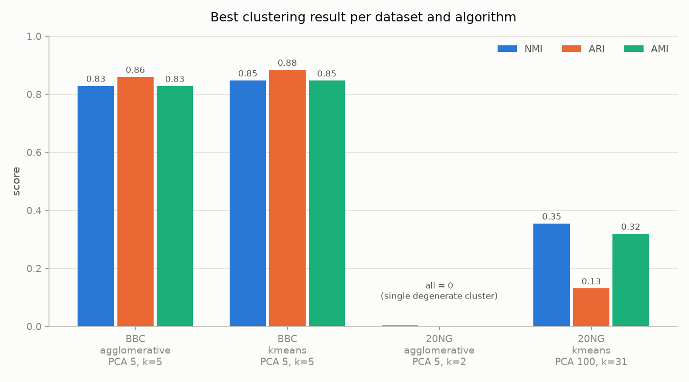

# Text Clustering with PCA and Word Embeddings

Clustering of two text datasets with PCA and Word Embeddings

## Datasets

**BBC News** — 1,490 news articles in 5 categories: business, entertainment,
politics, sport, tech. The categories are close to balanced, between 261 and 346
articles each. The articles are long, with a median of 337 words.

**20 Newsgroups** — 1,885 forum posts in 20 topics. I use the 10% stratified split
so the size stays comparable to BBC News. The topics are not balanced, from 100
posts down to 63. The posts are much shorter than BBC articles.

## Pipeline

1. Load the documents.
2. Build TF-IDF vectors.
3. Reduce the dimensions with PCA.
4. Find the number of clusters k from the data, using silhouette and elbow.
5. Cluster with K-Means and Agglomerative Clustering.
6. Score the clusters against the true labels with NMI, ARI and AMI.


## TF-IDF

I implemented three embedding methods and compared them before choosing.

TF-IDF works well here because both datasets are topic-based. Topics are separated
mainly by which words appear, and that is what TF-IDF measures. It also
needs no training, so results are stable and reproducible.


So the final pipeline uses TF-IDF. `build_word2vec` and `build_fasttext` are kept
in `features.py`

## Main decisions

**Cosine distance instead of Euclidean.** Documents have different lengths, which
changes the size of their vectors without changing their topic. Euclidean distance
would treat a short and a long article on the same subject as far apart. I compare
documents by direction instead. K-Means has no cosine option in scikit-learn, so I
normalise every vector to unit length first, which makes Euclidean distance behave
like cosine. Agglomerative Clustering accepts a distance matrix, so it gets real
cosine distances.

**TruncatedSVD for TF-IDF, PCA for dense vectors.** Scikit-learn's PCA cannot take
sparse input, because centering the data destroys sparsity. TruncatedSVD is the
same decomposition without the centering step and works directly on sparse
matrices. `reduce_dimensions` picks the right one automatically.

**Precomputed distance matrices.** AgglomerativeClustering rejects sparse input so I compute the distance matrix once and reuse it for every
k. Its size depends on the number of documents, not on the vocabulary.

**TF-IDF settings.** I did not keep the scikit-learn defaults because I concluded that they are causing problems in performance.


**Fixed random seeds** everywhere, and single-threaded gensim training, so every
run gives the same numbers.

## What did not work

**Raw TF-IDF is unusable.** With the full vocabulary of 24,746 words for BBC and
27,379 for 20 Newsgroups, all three algorithms failed:


| K-Means | Silhouette between -0.03 and 0.01 across the whole k = 2 to 30 range. |

| Agglomerative | The silhouette was identical for every k. |

| HDBSCAN | 2 clusters on BBC with 38% of documents marked as noise. On 20 Newsgroups it found 0 clusters and marked everything as noise. |


## TF-IDF settings 

I changed three things:

- `min_df=5` removes words appearing in fewer than 5 documents. On 20 Newsgroups
  this cut the vocabulary from 27,379 to 5,062 words.
- `max_df=0.5` removes words appearing in more than half the documents, which cannot separate anything.
- `sublinear_tf=True` uses a logarithmic scale for term frequency.


## Results

Best configuration for each dataset, with k found without labels:

| Dataset | PCA | Algorithm | k found | True k | NMI | ARI | AMI |

| BBC News | 5 | K-Means | 5 | 5 | 0.847 | 0.884 | 0.847 |
| BBC News | 5 | Agglomerative | 5 | 5 | 0.829 | 0.860 | 0.828 |
| 20 Newsgroups | 100 | K-Means (silhouette) | 31 | 20 | 0.354 | 0.131 | 0.319 |
| 20 Newsgroups | 100 | K-Means (elbow) | 21 | 20 | 0.353 | 0.146 | 0.329 |



On BBC both algorithms find exactly 5 clusters and score above 0.82.

On 20 Newsgroups the two selection rules end up almost equal on NMI, but elbow is
better on ARI and AMI. Those two are corrected for chance, which matters when
comparing different numbers of clusters, so I consider elbow the better choice
here. It also finds k = 21 against a true 20.

### The best number of PCA components is different for each dataset

BBC needs only 5 components and 20 Newsgroups needs 100. BBC has few categories
with clearly different vocabularies, so a small number of components is enough. 20
Newsgroups has many overlapping topics and needs more detail to tell them apart.


## Project structure

```
src/
  data_loading.py     loads both datasets into the same format
  features.py         TF-IDF, Word2Vec and FastText
  utils.py            normalisation and cosine distance matrix
  k_selection.py      silhouette and elbow sweeps for finding k
  clustering.py       K-Means, Agglomerative and HDBSCAN
  dimensionality.py   TruncatedSVD and PCA
  evaluation.py       NMI, ARI, AMI
  visualization.py    the figures
scripts/
  run_pipeline.py     runs everything and writes results/metrics.csv
  experiments.py      the experiments that led to the settings above
results/              tables and figures
data/                 not included in the repository
```

Every module can also be run on its own as a check, for example
`python src/k_selection.py`.


## Results files

| File | Content |
|---|---|
| `metrics.csv` | the main table, 36 experiments |
| `diagnostic_20ng_nmi_vs_k.csv` | NMI against k for 20 Newsgroups, before the settings changed |
| `diagnostic_20ng_tfidf_variants.csv` | comparison of the four TF-IDF variants on 20 Newsgroups |
| `diagnostic_bbc_tfidf_variants.csv` | the same comparison on BBC |
| `labelfree_20ng_best_config.csv` | full k sweep on the final 20 Newsgroups configuration |
| `k_selection_*.csv` | k sweeps without PCA |
| `figures/` | the six figures used above |
